Insta 360 pro 2 
================

This manual is ``Insta 360 pro2`` device setting 
and connect to ``Insta 360 pro2 viewer``

Acknowledgement
---------------

* The official manual on [youtube](https://www.youtube.com/watch?v=mnjheVFcMq4&list=PLMfJuQCwKsWc62_yii58ZjNtr8czfdJWQ) 

* The official [site](https://www.insta360.com/kr/product/insta360-pro2)

Device environment
------------------
* Window 11 

Fisrt Step
-----------

  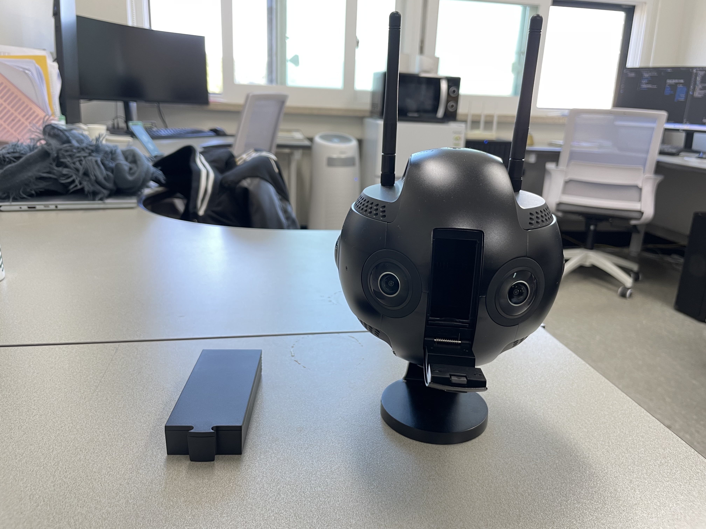
  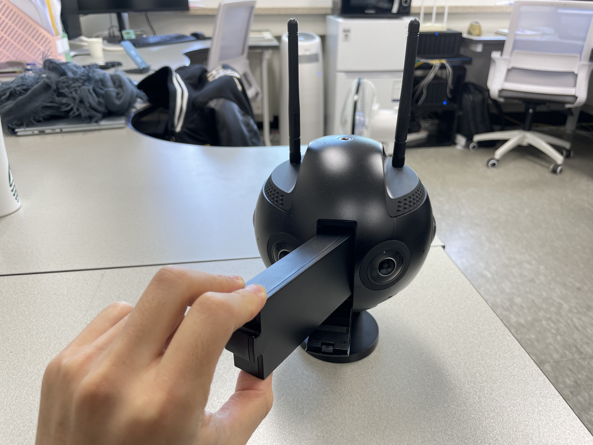
  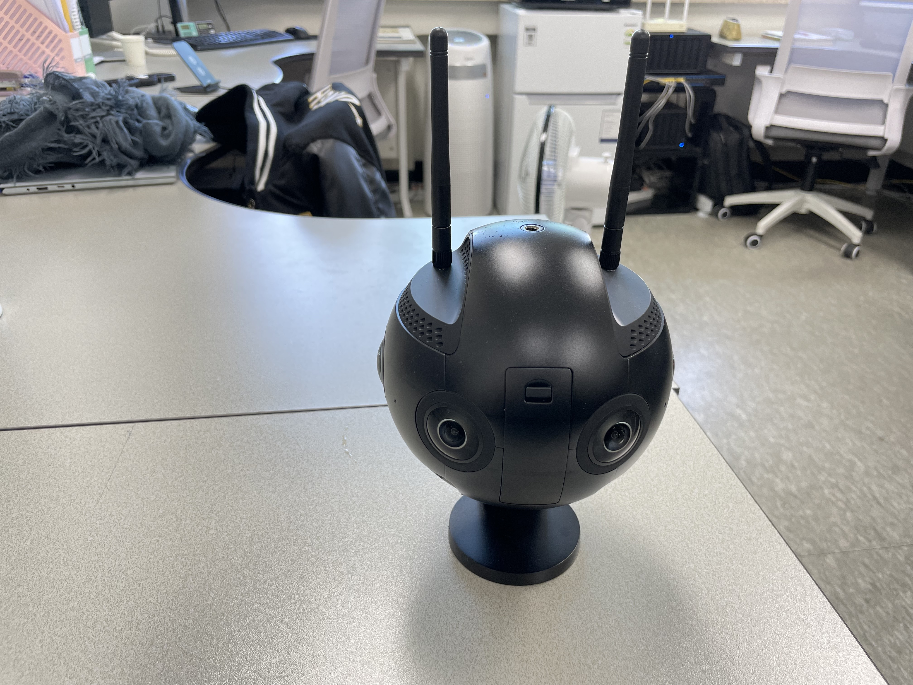

1. setup ``Insta 360 pro2`` and ``battery``
2. Open battery socket in Insta 360 pro2 and input battery
3. Close battery socket cover 
* We can use 50 minutes in wireless mode 
* Power cable need a ``adapter plug`` that changes from 110v to 220v 

Firmware Update
---------------

<figure>
  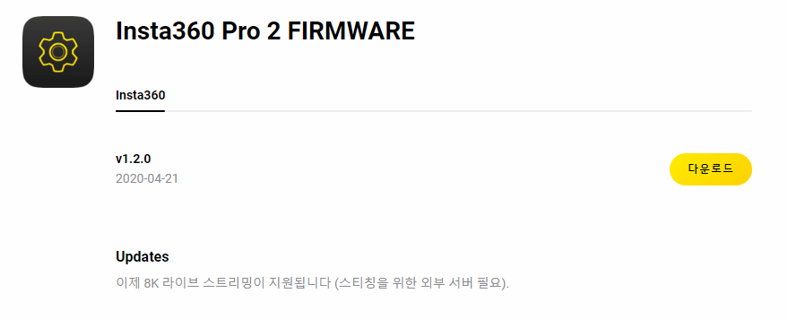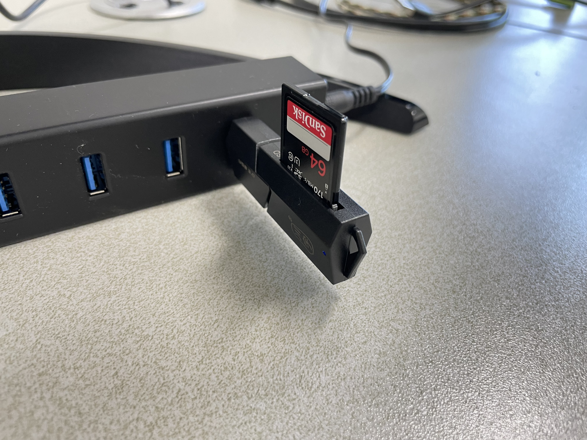
</figure>

1. Download the lasets frimware [here](https://www.insta360.com/kr/download/insta360-pro2)
2. Move ``Insta360_Pro2_Update.bin`` to SD card
3. Insert SD card to slot ``under the battery socket``
4. Restart Insta 360 pro 2 

Wireless connection
-------------------
<figure>
  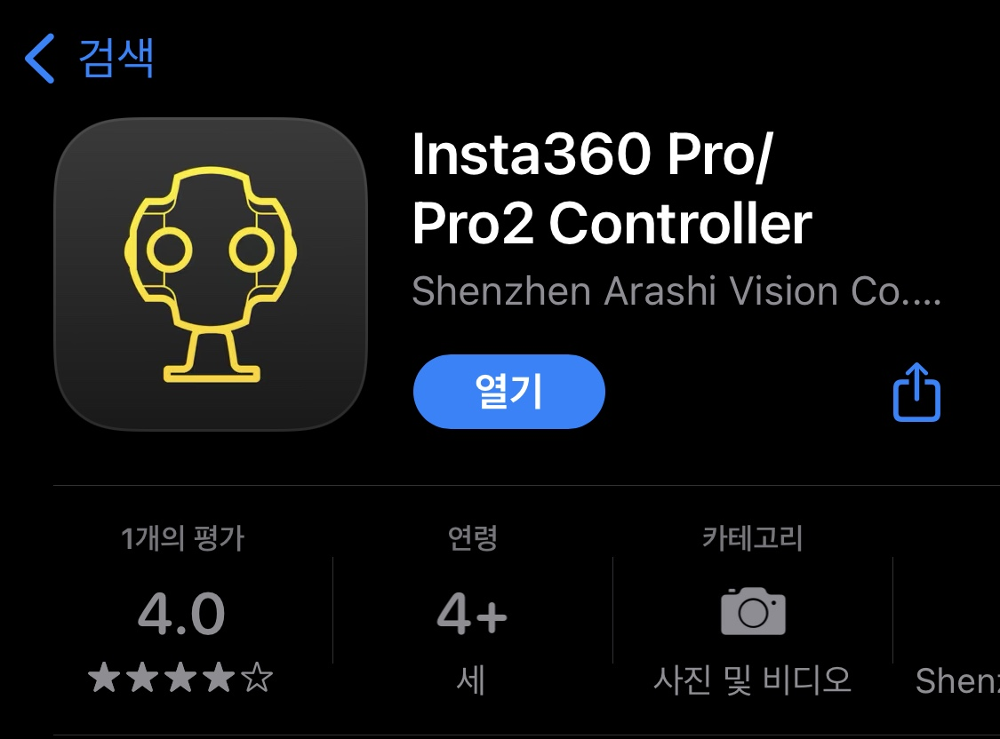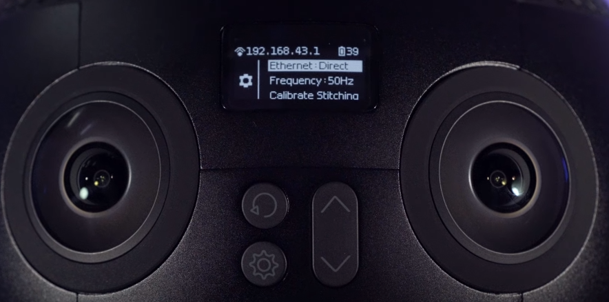
</figure>

1. Download ``Insta360 Pro/Pro2 Controller App`` 
2. Click under gear button and set Ethernet mode to ``DHCP mode``
<figure>
  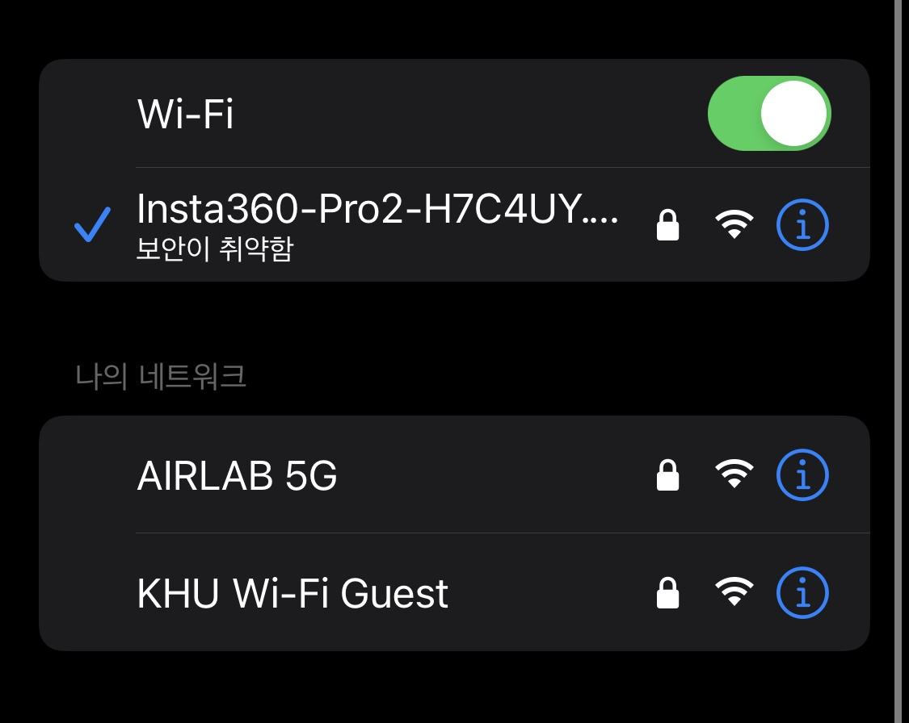
</figure>

3. Use Insta 360 pro2 ``Hotspot``. The default password is ``88888888``

<figure>
  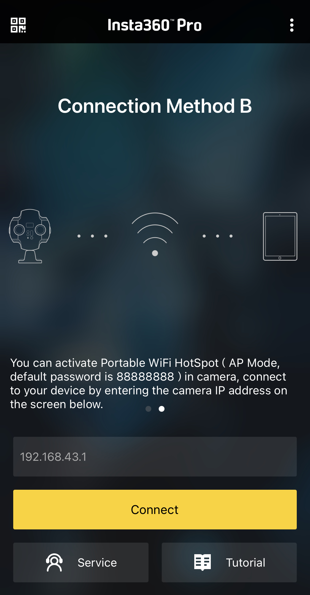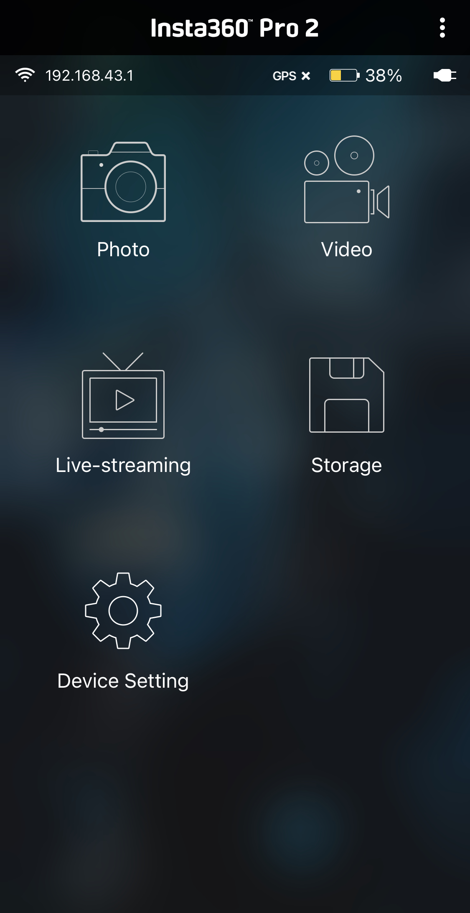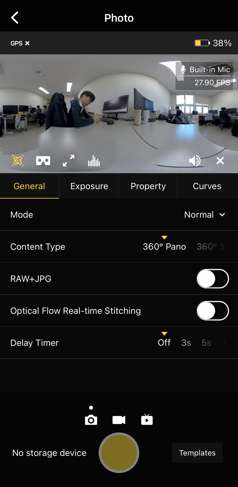
</figure>

4. Click ``Insta360 Pro/Pro2 Controller App`` and select ``Connection Method B``
5. Click ``Photo`` button. If you insert 6 micro sd cards then you can take pictures. 